# Routing Flows

System-wide routing documentation for OpenCode commands, workflows, skills, and rules.

## Source Files Inventory

### Commands (7)

| File | Purpose |
|------|---------|
| `.opencode/commands/debug.md` | Enter sandbox mode, disable vault writes |
| `.opencode/commands/discover-requirements.md` | Discover project requirements |
| `.opencode/commands/ingest.md` | Route note/source to appropriate workflow |
| `.opencode/commands/lint-vault.md` | Run vault linting |
| `.opencode/commands/process-pending.md` | Process pending items |
| `.opencode/commands/solidify.md` | Promote brainstorm to wiki |
| `.opencode/commands/write_plan.md` | Write execution plan |

### Workflows (7)

| File | Purpose |
|------|---------|
| `.opencode/workflows/distill-brainstorm.md` | Distill brainstorm notes |
| `.opencode/workflows/ingest-my-work.md` | Ingest from my-work/ |
| `.opencode/workflows/ingest-resources.md` | Ingest external resources |
| `.opencode/workflows/lint-vault.md` | Lint vault for issues |
| `.opencode/workflows/process-pending-resources.md` | Process pending resources |
| `.opencode/workflows/query-vault.md` | Query vault knowledge |
| `.opencode/workflows/solidify-to-wiki.md` | Promote to wiki |

### Rules (11)

| File | Purpose |
|------|---------|
| `.opencode/rules/core-vault.md` | Vault structure and semantics |
| `.opencode/rules/debug-mode.md` | Debug mode behavior |
| `.opencode/rules/edit-policy.md` | Edit permission policy |
| `.opencode/rules/low-confidence-brainstorm.md` | Low confidence handling |
| `.opencode/rules/metadata-conventions.md` | Metadata schema |
| `.opencode/rules/periodic-lint.md` | Periodic linting |
| `.opencode/rules/promotion-policy.md` | Brainstorm → wiki promotion |
| `.opencode/rules/post-brainstorm-solidify.md` | Post-solidify actions |
| `.opencode/rules/post-ingest-solidify.md` | Post-ingest actions |
| `.opencode/rules/query-confidence.md` | Query confidence levels |
| `.opencode/rules/query-on-interaction.md` | Query on user interaction |

### Skills (6)

| File | Purpose |
|------|---------|
| `.opencode/skills/brainstorm-distill/SKILL.md` | Distill brainstorm notes |
| `.opencode/skills/second-brain-ingest/SKILL.md` | Route to vault layers |
| `.opencode/skills/second-brain-lint/SKILL.md` | Lint vault |
| `.opencode/skills/second-brain-query/SKILL.md` | Query vault |
| `.opencode/skills/solidify-to-wiki/SKILL.md` | Promote to wiki |
| `.opencode/skills/web-to-resource/SKILL.md` | Convert URLs to resources |

### Plugins (1)

| File | Purpose |
|------|---------|
| `.opencode/plugins/auto-frontmatter/README.md` | Auto frontmatter |

### Docs (1)

| File | Purpose |
|------|---------|
| `docs/sqlite-dataview-alignment.md` | SQLite mirror for Dataview-aligned retrieval |

---

## Command Routing Graphs

### Ingest Command

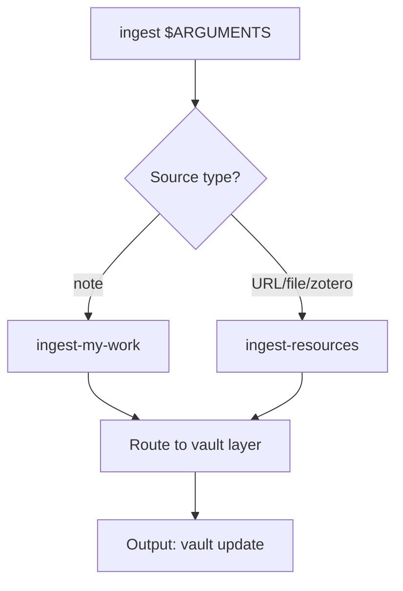

**Routing Standards:**
- `ingest-my-work` for active notes from `workbook/my-work/`
- `ingest-resources` for external sources (URLs, PDFs, Zotero)

### Debug Command

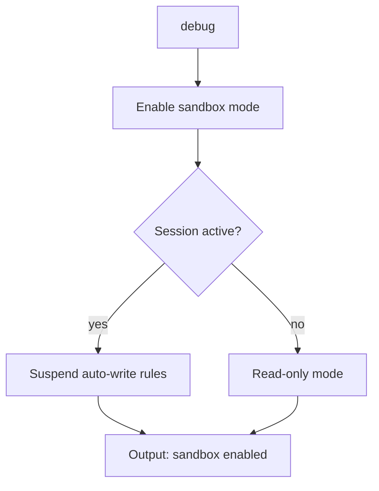

**Routing Standards:**
- Debug mode is session-scoped
- Disables: query-on-interaction, low-confidence-brainstorm, post-*-solidify rules

### Solidify Command

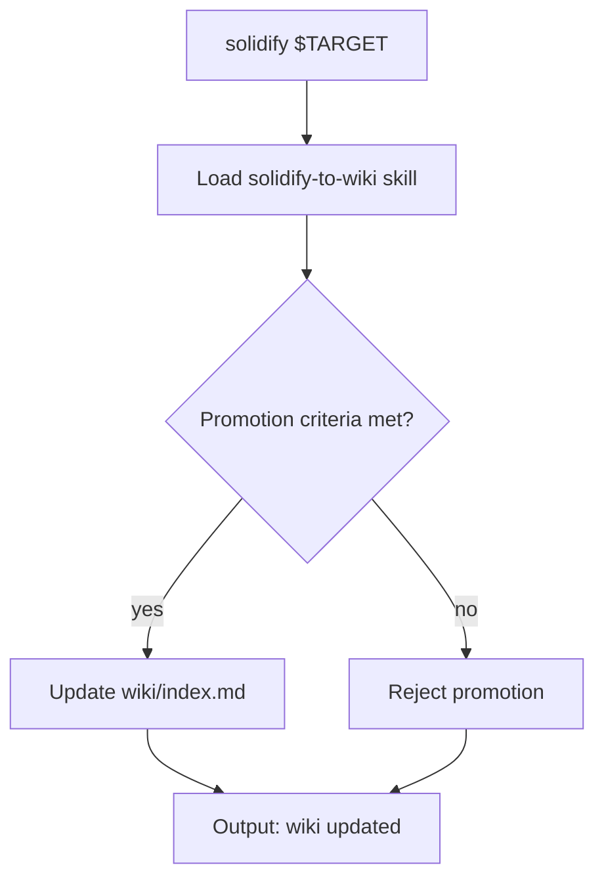

**Routing Standards:**
- Only `solidify` is the promotion gate into `workbook/wiki/`
- Requires grounded claims with provenance

---

## Workflow Routing Graphs

### Ingest Resources Workflow

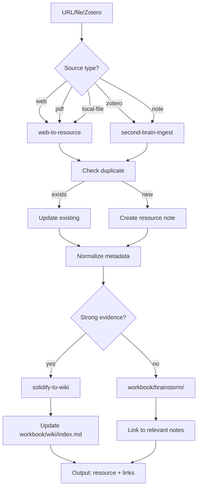

**Routing Standards:**
- Default derived material to `workbook/brainstorm/`
- Only promote to `workbook/wiki/` via explicit `solidify` gate

### Solidify to Wiki Workflow

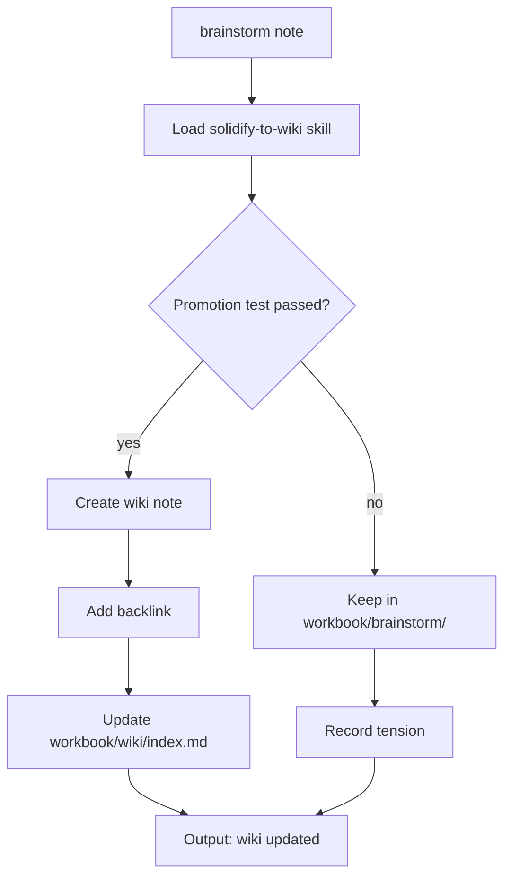

**Routing Standards:**
- Preserve backlink to brainstorm source
- Record tension if evidence is mixed

### Query Vault Workflow

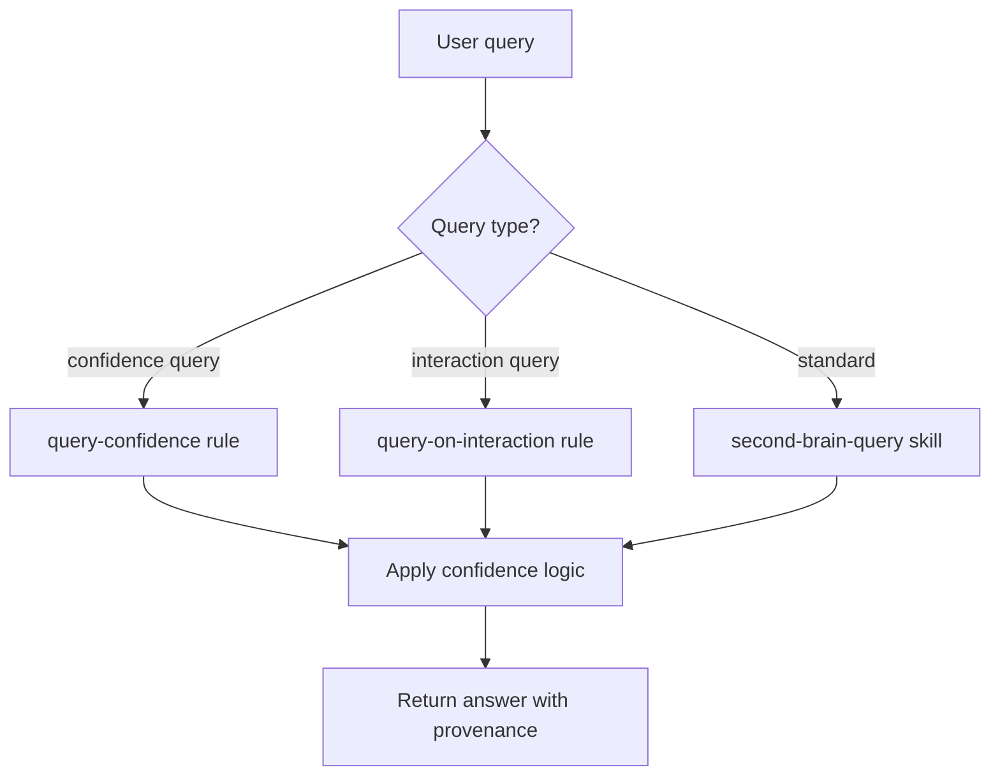

---

## Skill Routing Graphs

### Second Brain Ingest Skill

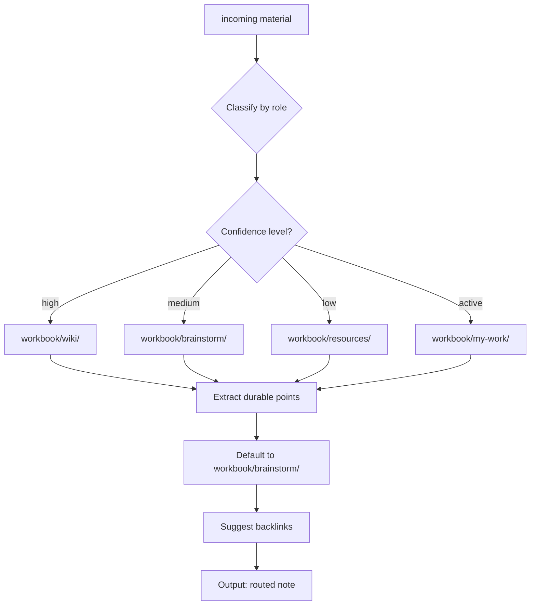

**Skill Bounds:**
- Keep user-authored notes intact
- Do not promote speculative claims to `workbook/wiki/` by default

### Web to Resource Skill

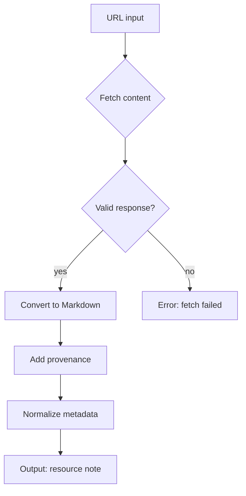

---

## Rule Routing Graphs

### Promotion Policy Rule

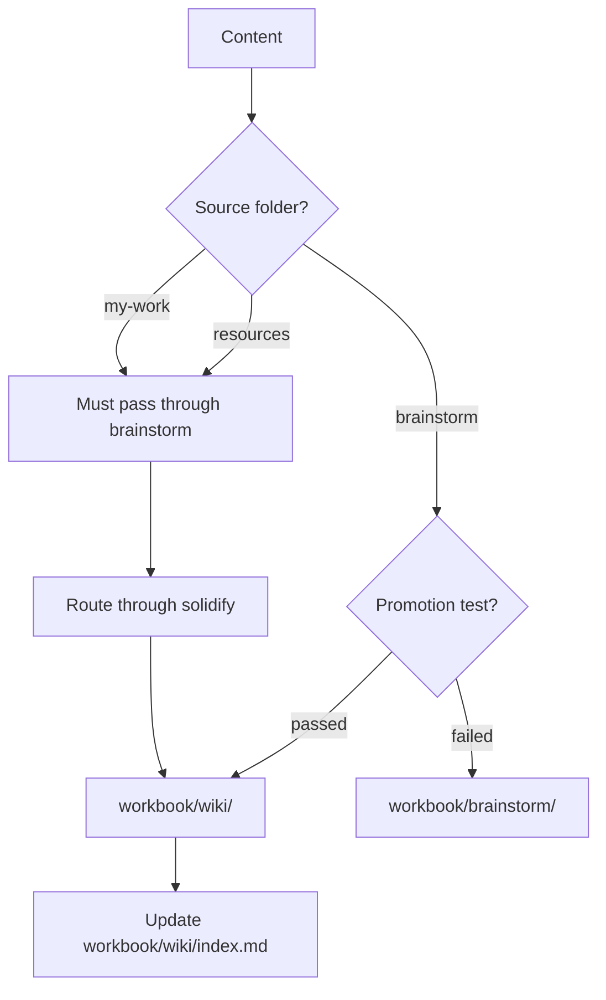

**Must:**
- Entry into `workbook/wiki/` must go through `solidify` gate
- Prefer promoting selected grounded claims

**Must Not:**
- Do not promote directly from `workbook/my-work/` or `workbook/resources/` to `workbook/wiki/`

### Query Confidence Rule

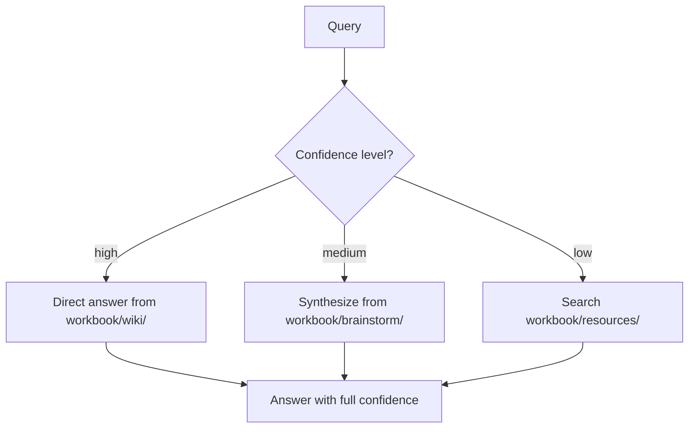

### Debug Mode Rule

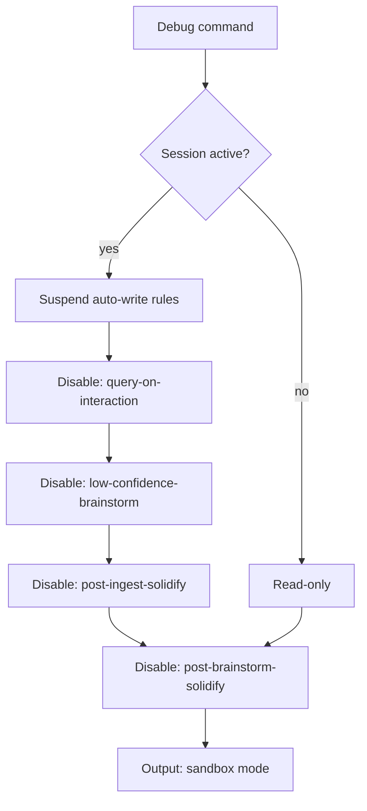

---

## Routing Standards

### Layer Handoff Rules

1. **Commands → Workflows**: Commands select workflow based on input type
2. **Workflows → Skills**: Workflows delegate to skills for specialized tasks
3. **Workflows → Rules**: Workflows check rules for validation
4. **Skills → Rules**: Skills apply rules for routing decisions
5. **Rules**: Terminal layer - no further routing

### Default Paths

- Derived material: `workbook/brainstorm/` by default
- External sources: `workbook/resources/` for capture, `workbook/brainstorm/` for synthesis
- Promotion: Only through `solidify` gate
- Debug: Session-scoped, disables all auto-write rules

### Stop Conditions

- `debug` mode active: All writes suspended
- Promotion test failed: Content stays in `workbook/brainstorm/`
- Duplicate found: Update existing instead of creating new
- Invalid source: Error and exit
