# Routing Flows

Source inventory and routing diagrams for the `.opencode/` configuration layer.

## Source Files Inventory

### Commands (5)

| Command | Workflow | Description |
|---------|----------|-------------|
| `lint-vault.md` | `lint-vault.md` | Audit vault for metadata and knowledge quality |
| `brainstorm.md` | `distill-brainstorm.md` | Distill or expand brainstorm material |
| `solidify.md` | `solidify-to-wiki.md` | Promote grounded knowledge into wiki |
| `ingest.md` | `ingest-my-work.md` / `ingest-resources.md` | Ingest notes or sources into vault |
| `query.md` | `query-vault.md` | Query vault with confidence and provenance |

### Workflows (6)

| Workflow | Skills | Subagents | Description |
|----------|--------|-----------|-------------|
| `lint-vault.md` | `second-brain-lint` | `provenance-auditor`, `wiki-curator` | Audit vault for quality issues |
| `solidify-to-wiki.md` | `solidify-to-wiki`, `second-brain-query` | `wiki-curator`, `provenance-auditor` | Promote grounded knowledge to wiki |
| `distill-brainstorm.md` | `brainstorm-distill`, `second-brain-ingest` | `brainstorm-catalyst`, `vault-researcher` | Clarify brainstorm material |
| `query-vault.md` | `second-brain-query` | `vault-researcher`, `provenance-auditor` | Answer vault questions |
| `ingest-my-work.md` | `second-brain-ingest`, `solidify-to-wiki` | `brainstorm-catalyst`, `wiki-curator` | Ingest active notes |
| `ingest-resources.md` | `web-to-resource`, `second-brain-ingest` | `vault-researcher`, `wiki-curator` | Ingest external sources |

### Skills (6)

| Skill | Description |
|-------|-------------|
| `solidify-to-wiki` | Promote grounded knowledge into wiki with provenance |
| `web-to-resource` | Convert URLs/artifacts into Markdown resource notes |
| `brainstorm-distill` | Distill exploratory notes into clearer hypotheses |
| `second-brain-lint` | Audit vault for metadata, duplicates, promotion candidates |
| `second-brain-query` | Answer vault questions with folder-aware confidence |
| `second-brain-ingest` | Route notes/sources into correct vault layer |

### Agents (5)

| Agent | Mode | Role |
|-------|------|------|
| `vault-orchestrator` | hidden | Orchestrates commands via workflows |
| `provenance-auditor` | subagent | Audits claims and source support |
| `vault-researcher` | subagent | Gathers evidence across vault notes |
| `wiki-curator` | subagent | Curates wiki notes for structure |
| `brainstorm-catalyst` | subagent | Expands speculative ideas |

### Rules (5)

| Rule | Purpose |
|------|---------|
| `core-vault.md` | Folder semantics, knowledge standards, decision priority |
| `edit-policy.md` | Edit behavior by folder |
| `promotion-policy.md` | Brainstorm-to-wiki promotion criteria |
| `metadata-conventions.md` | YAML frontmatter schemas |
| `query-confidence.md` | Folder priority for answers |

---

## Command Routing Diagrams

### /lint-vault

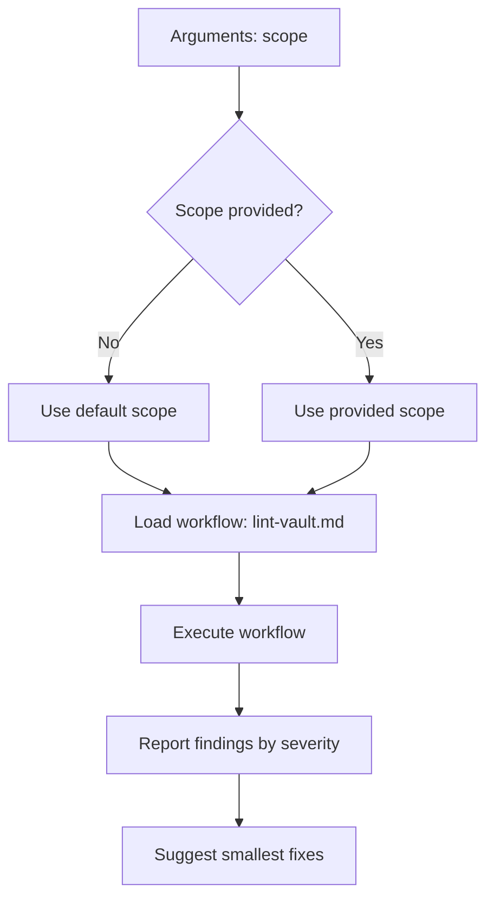

**Routing Standards:**
- One workflow: `lint-vault.md`
- Reports findings before suggesting fixes
- Stops at workflow handoff

---

### /brainstorm

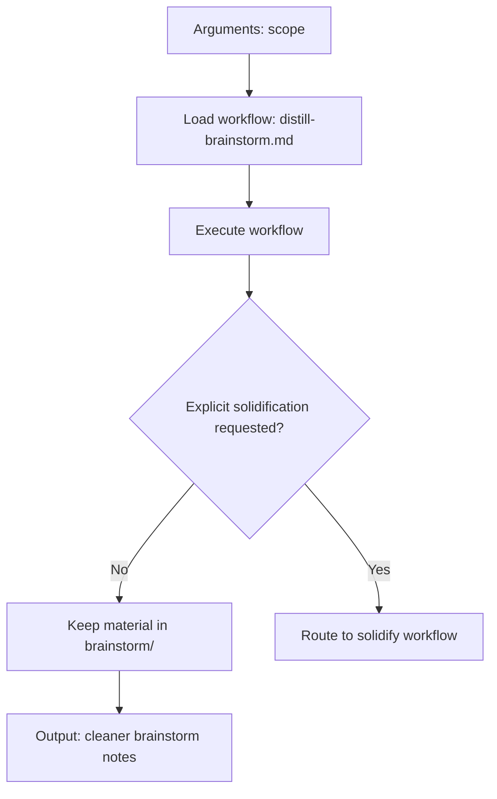

**Routing Standards:**
- Default: keep speculative material in `brainstorm/`
- Only promote when explicitly requested
- Stops at workflow handoff

---

### /solidify

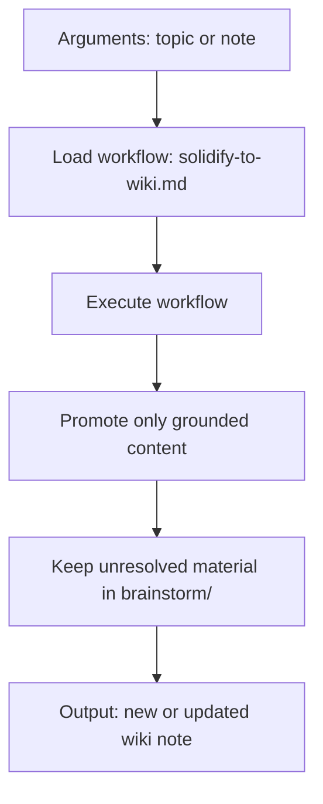

**Routing Standards:**
- Promotes only grounded content
- Preserves speculative material location
- Stops at workflow handoff

---

### /ingest

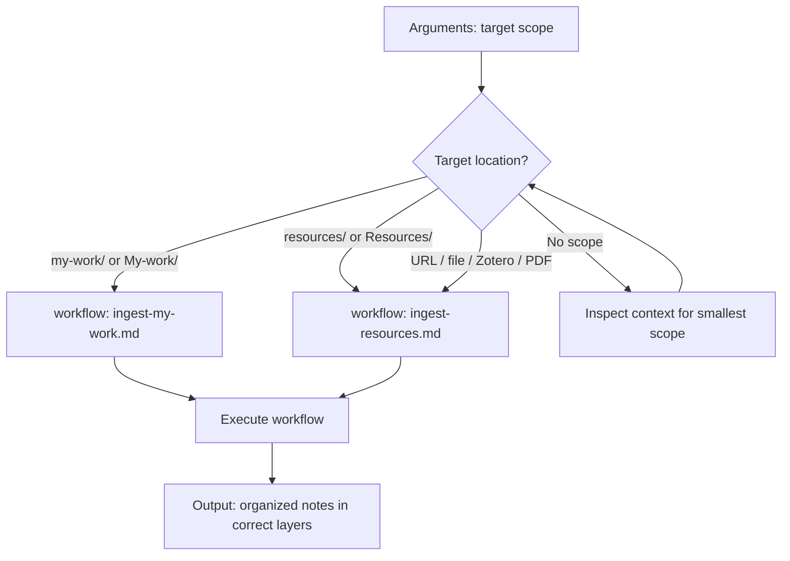

**Routing Standards:**
- Branch on target type
- Default: inspect recent context
- Stops at workflow handoff

---

### /query

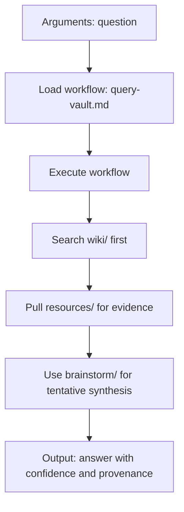

**Routing Standards:**
- Folder priority: `wiki/` → `resources/` → `brainstorm/`
- Explicit confidence labeling
- Stops at workflow handoff

---

## Workflow Routing Diagrams

### lint-vault

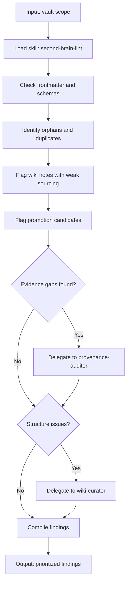

**Handoffs:**
- `provenance-auditor`: evidence gaps, wiki support issues
- `wiki-curator`: duplicates, structure findings

---

### solidify-to-wiki

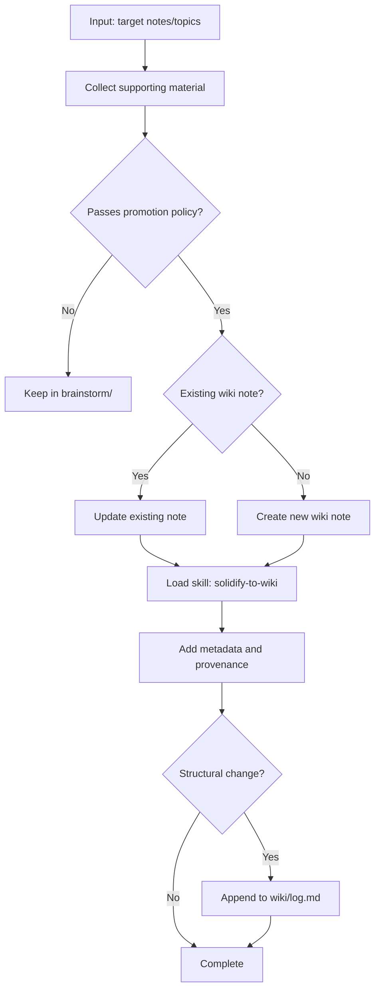

**Handoffs:**
- `wiki-curator`: deduplication, naming, normalization
- `provenance-auditor`: mixed or weak support checking

---

### distill-brainstorm

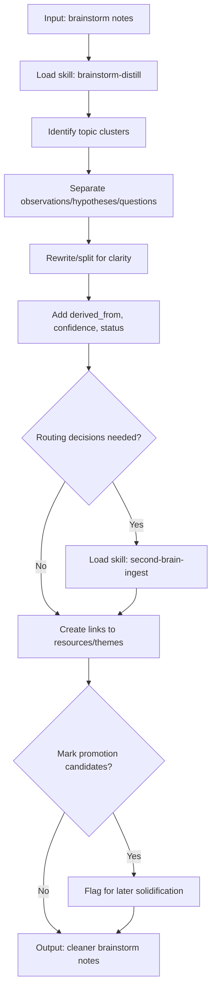

**Handoffs:**
- `brainstorm-catalyst`: larger thematic clustering, fresh synthesis
- `vault-researcher`: missing evidence gathering

---

### query-vault

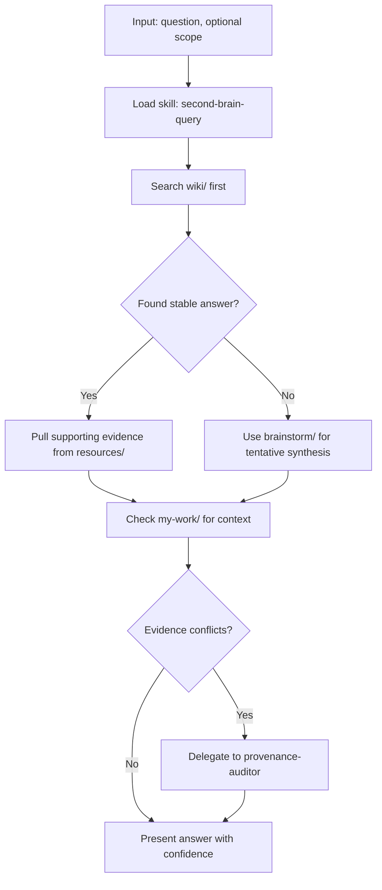

**Handoffs:**
- `vault-researcher`: broad evidence gathering
- `provenance-auditor`: conflicting or weak support

---

### ingest-my-work

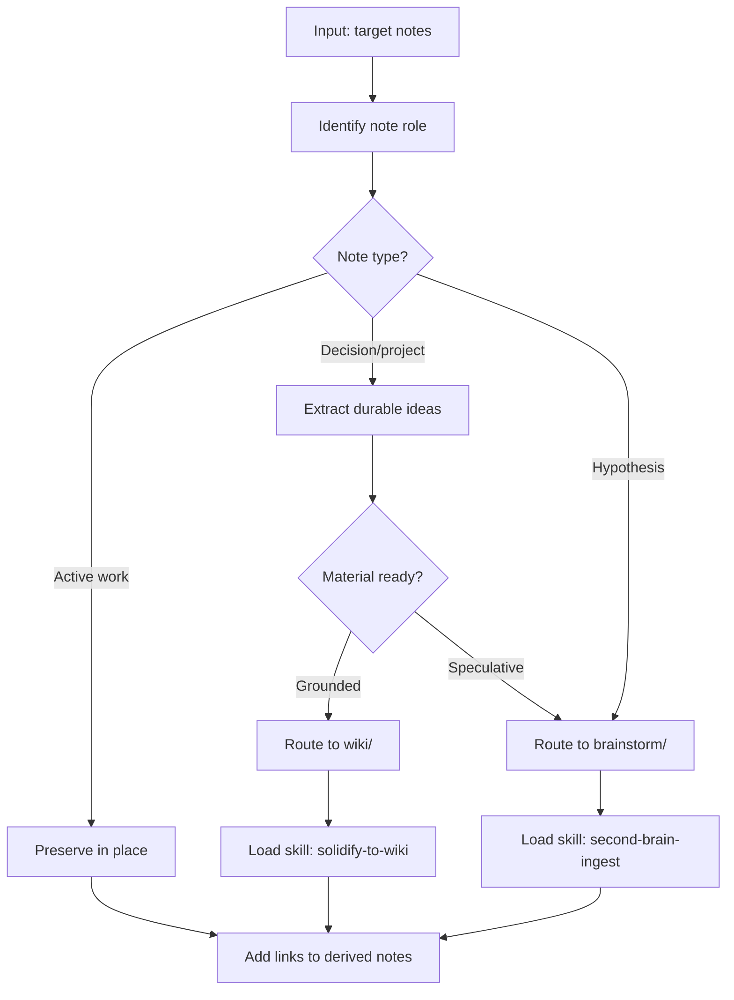

**Handoffs:**
- `brainstorm-catalyst`: exploratory clustering
- `wiki-curator`: careful deduplication

---

### ingest-resources

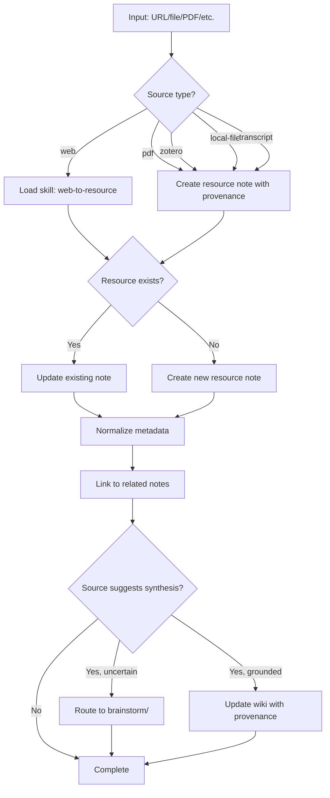

**Handoffs:**
- `vault-researcher`: multiple source comparison
- `wiki-curator`: durable wiki update

---

## Skill Routing Diagrams

### solidify-to-wiki

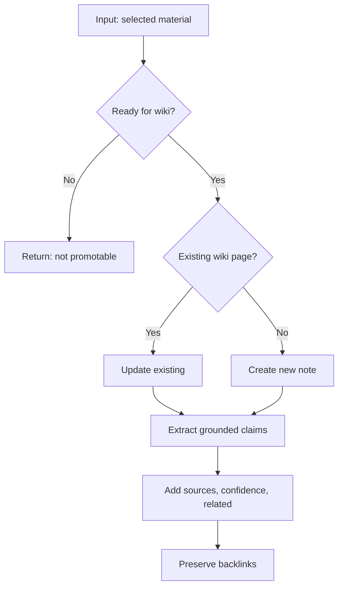

**Bounds:**
- Does not promote unresolved speculation
- Prefers updating existing pages over duplicates

---

### web-to-resource

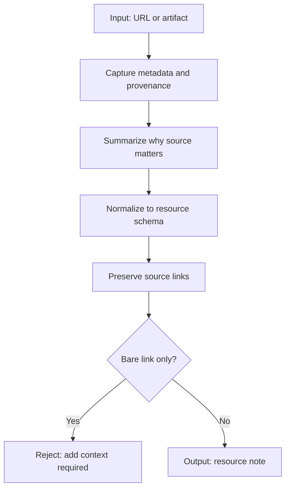

**Bounds:**
- Bare links are insufficient
- Must keep original source identity and capture date

---

### brainstorm-distill

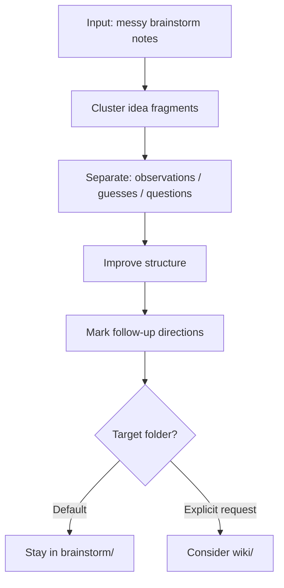

**Bounds:**
- Defaults to `brainstorm/`, not `wiki/`
- Preserves uncertainty and derivation

---

### second-brain-lint

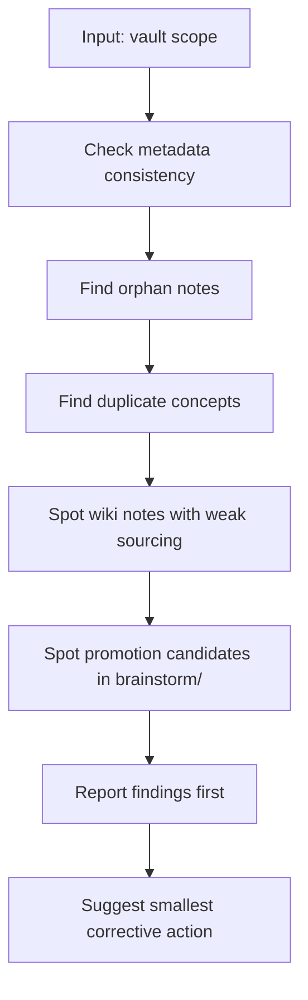

**Bounds:**
- Reports findings before recommendations
- Prefers smallest corrective action

---

### second-brain-query

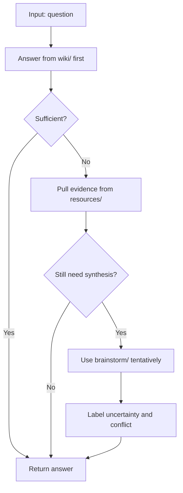

**Bounds:**
- Separates confirmed facts from hypotheses
- Prefers traceability over fluency

---

### second-brain-ingest

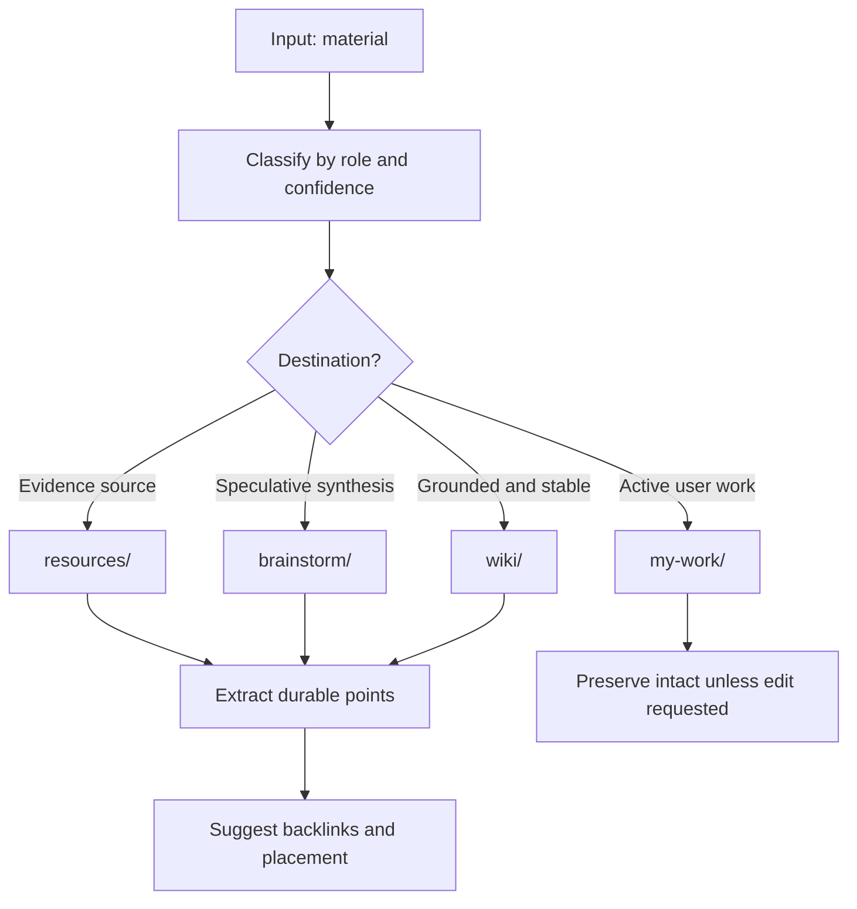

**Bounds:**
- Keeps user-authored active notes intact unless explicitly requested
- Does not promote speculative claims to `wiki/` by default

---

## Rule Routing Diagrams

### core-vault

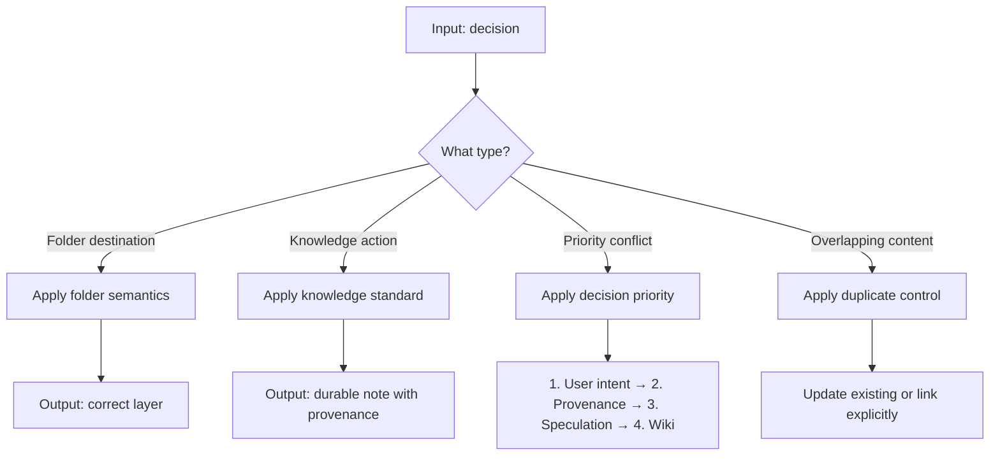

**Must:**
- Route material to correct layer
- Preserve provenance with sources

**Must Not:**
- Flatten active user intent
- Lose source context

---

### edit-policy

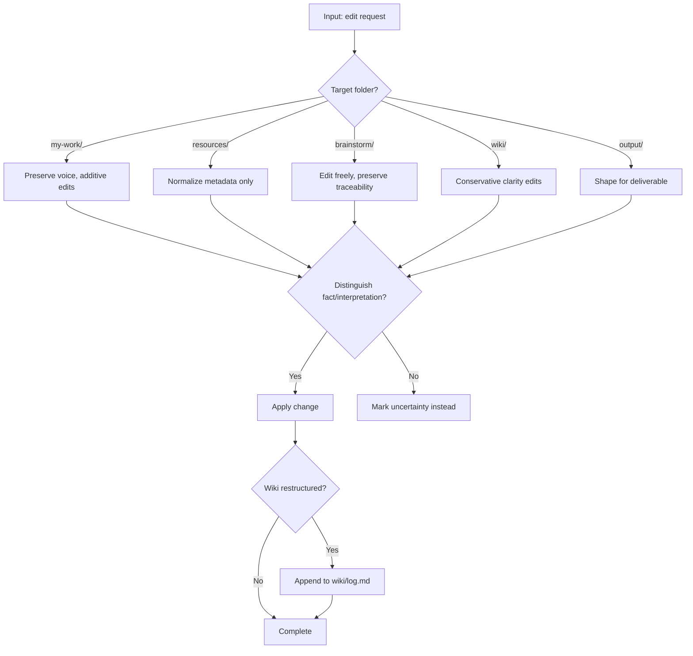

**Must:**
- Distinguish fact, interpretation, hypothesis
- Mark uncertainty when support is weak

**Must Not:**
- Rewrite source content misleadingly
- Lose useful backlinks

---

### promotion-policy

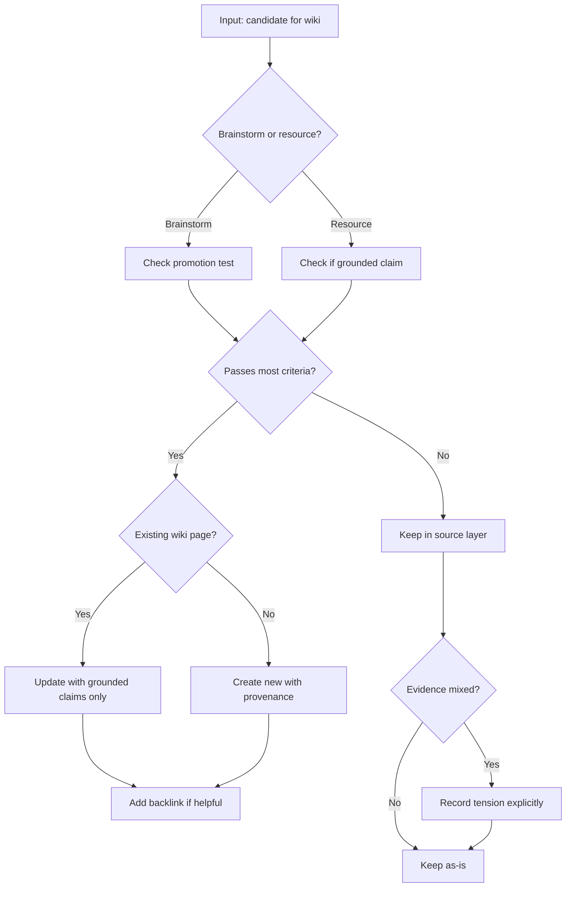

**Must:**
- Promote only grounded claims
- Attach provenance directly
- Record tensions when evidence is mixed

**Must Not:**
- Promote entire speculative notes
- Promote when evidence is mixed without noting tension

---

### metadata-conventions

```mermaid
flowchart TD
    A[Input: durable note] --> B{Note type?}
    B -->|Resource| C[Use resource schema]
    B -->|Brainstorm| D[Use brainstorm schema]
    B -->|Wiki| E[Use wiki schema]
    C --> F[Add provenance + summary]
    D --> G[Add uncertainty + derivation]
    E --> H[Add explicit sources]
    F --> I[Validate against schema]
    G --> I
    H --> I
    I --> J{Valid?}
    J -->|Yes| K[Accept]
    J -->|No| L[Fix missing fields]
    L --> I
```

**Must:**
- Use YAML frontmatter for durable notes
- Include type-appropriate metadata

**Must Not:**
- Skip provenance on resource notes
- Skip uncertainty on brainstorm notes

---

### query-confidence

```mermaid
flowchart TD
    A[Input: question] --> B[Search wiki/ first]
    B --> C{Found?}
    C -->|Yes| D[Return stable answer]
    C -->|No| E[Search resources/]
    E --> F{Found?}
    F -->|Yes| G[Return with evidence and provenance]
    F -->|No| H[Use brainstorm/ tentatively]
    H --> I[Label as tentative synthesis]
    I --> J{Evidence conflicts?}
    J -->|Yes| K[State conflict plainly]
    J -->|No| L[Return answer with confidence]
    K --> L
```

**Must:**
- State confidence level when not fully grounded
- Cite folder or note source
- State conflicts plainly

**Must Not:**
- Collapse conflicting evidence
- Present speculation as fact

---

## Routing Standards

### Layer Boundary Rules

1. **Command diagrams** show: arguments → validation → workflow selection → output
2. **Workflow diagrams** show: stage flow, decision points, handoffs to skills/rules
3. **Skill diagrams** show: when to use, bounds, the skill's own decisions
4. **Rule diagrams** show: must/must not logic, acceptance checks

### Stop Conditions

- Commands stop at workflow handoff
- Workflows stop at skill/rule handoff
- Skills stop at their own bounds
- Rules stop at acceptance criteria

### Decision Point Visibility

All routing diagrams must explicitly show:
- Input validation branches
- Target selection branches
- Scope defaulting
- Handoff decisions
- Error/stop conditions